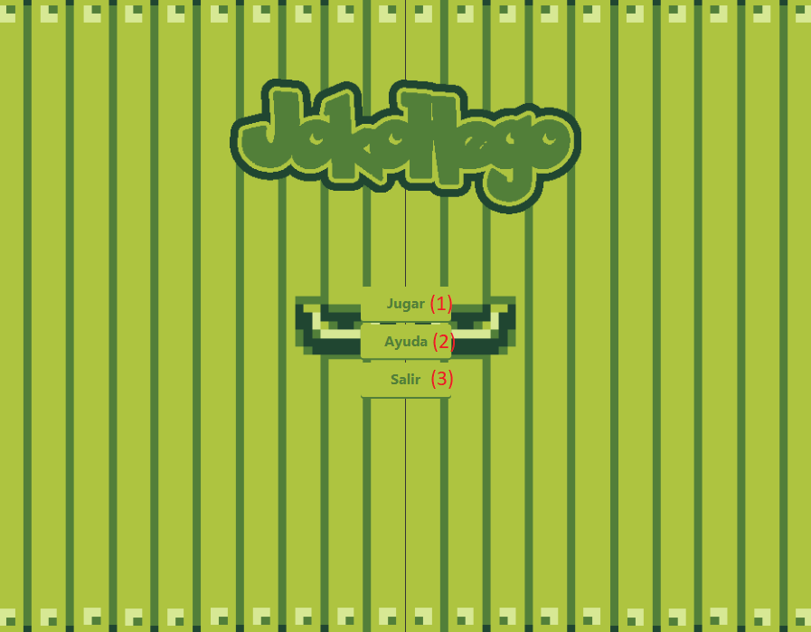
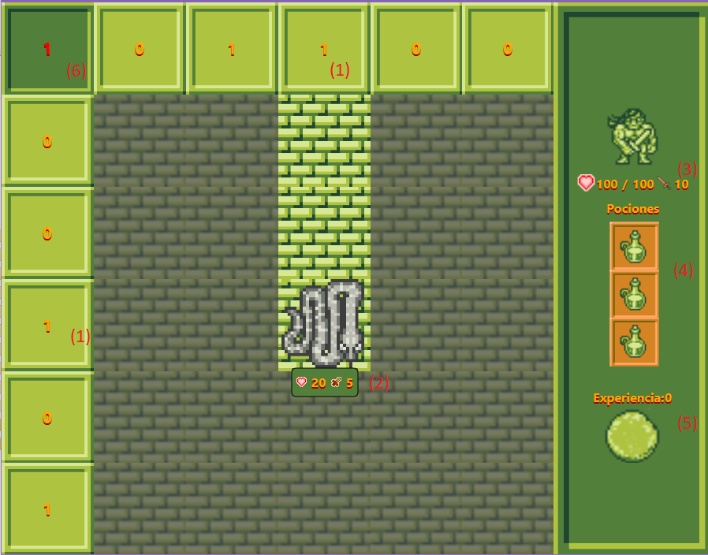
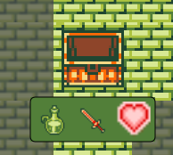
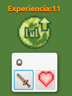

# Manual de uso de JokoHego

Al iniciar el juego se monstrará la siguiente pantalla:

**1** - Empezar una partida.

**2** - Abrir un enlace a github donde se muestra este manual de uso.

**3** - Salir de la aplicación.

####  Pantalla de partida

Una vez dentro de la partida tendrás que clicar en las diferentes losas oscuras para descubrir que hay detrás. 

La información que aparece en pantalla es la siguiente:

**1** - Número de enemigos en esa fila/columna.

**2** - Estadísticas de los enemigos.

**3** - Estadísticas del personaje

**4** - Pociones disponibles

**5** - Experiencia disponible

**6** - Piso actual

#### Explorar los niveles

Mientras completas los niveles te podrás encontrar con enemigos que no podrás ignorar ya que si descubres nuevas casillas teniendo monstruos en pantalla te haran daño. **(piso actual * nº de enemigos)**

#### Encontrar cofres

A lo largo de los diferentes niveles tienes una posibilidad de encontrar cofres que te permiten *Restablecer pociones* , *aumentar el daño* o *aumentar la vida máxima.* 

#### Utilizar la experencia

Cada vez que mates un enemigo se te recompensará con experiencia, con esta podrás *aumentar el daño* o *aumentar la vida máxima*

